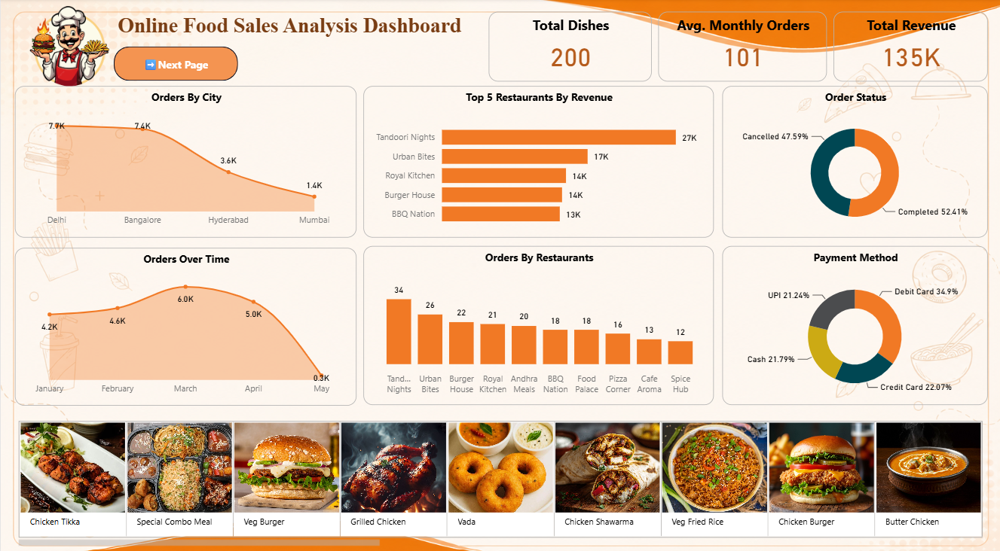
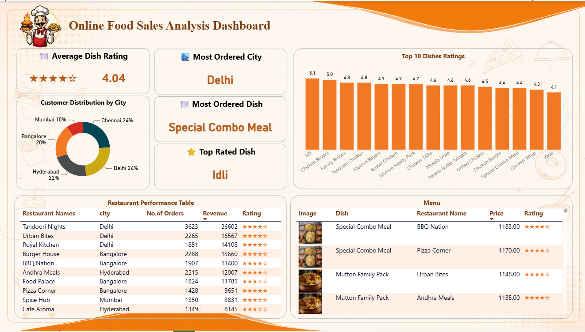

# 🍔 Online Food Ordering and Sales Analysis Dashboard

## 📊 Project Overview

An interactive **Online Food Ordering and Sales Analysis Dashboard** developed using **SQL and Microsoft Power BI** to analyze food orders, revenue, restaurants, dishes, customer preferences, ratings, payment methods, and city-wise performance.

The dashboard provides a clear view of sales performance and helps identify top-performing restaurants, popular dishes, and key business trends.

## 🛠️ Tools & Technologies

- SQL / MySQL
- Microsoft Power BI
- Power Query
- DAX

## 📌 Key KPIs

- **Total Revenue:** 135K
- **Average Monthly Orders:** 101
- **Total Dishes:** 200
- **Average Dish Rating:** 4.04
- **Completed Orders:** 52.41%
- **Cancelled Orders:** 47.59%

## 📈 Dashboard Analysis

### 🏠 Home Page – Sales Overview

The Home Page provides an overall view of online food sales performance, including orders over time, order status, payment methods, top restaurants by revenue, restaurant-wise orders, city-wise orders, and popular dishes.

---

### 📊 Next Page – Restaurant & Dish Analysis

The second dashboard page provides detailed insights into restaurant performance and dish-level analysis, including restaurant orders, revenue, ratings, most ordered dishes, and top-rated dishes.

---

## 🍽️ Restaurant Performance

Analyzed restaurants based on number of orders, revenue, city, and ratings.

Top revenue-generating restaurants include:

- Tandoori Nights
- Urban Bites
- Royal Kitchen
- Burger House
- BBQ Nation

## 🍛 Dish Analysis

Identified the most ordered and top-rated dishes, including:

- Special Combo Meal
- Idli
- Chicken Biryani
- Family Biryani
- Tandoori Chicken

## 💳 Payment Analysis

Analyzed customer payment preferences across:

- Debit Card
- Credit Card
- Cash
- UPI

## 📦 Order Status

Compared completed and cancelled orders to understand overall order fulfillment performance.

## 🎯 Key Insights

- **Delhi** is the most ordered city.
- **Tandoori Nights** generates the highest revenue among the analyzed restaurants.
- **Special Combo Meal** is the most ordered dish.
- The average dish rating is **4.04**.
- Debit Card is the most commonly used payment method.
- Completed orders account for **52.41%** of total orders.
